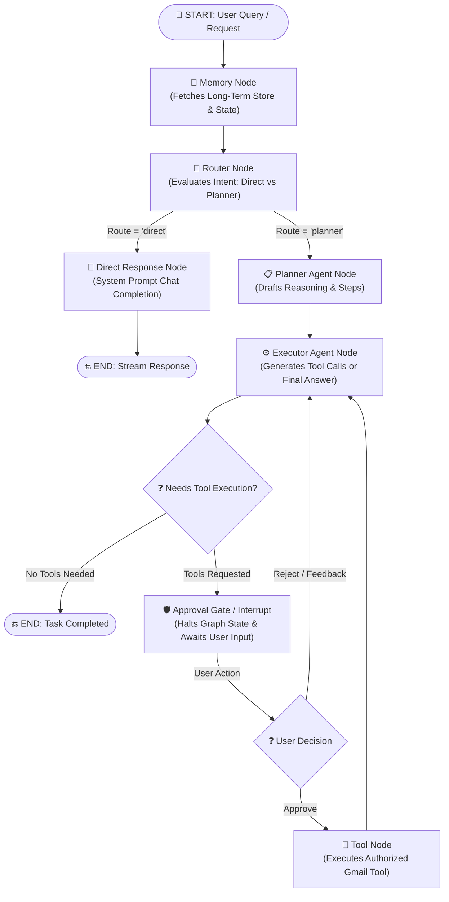

# 📥 Inbox OS - Advanced AI-Powered Mailbox Operating System

<div align="center">

[](https://www.python.org)
[](https://fastapi.tiangolo.com)
[](https://github.com/langchain-ai/langgraph)
[](https://sqlmodel.tiangolo.com)
[](https://www.postgresql.org)
[](https://upstash.com)
[](https://developers.google.com/gmail/api)
[](https://www.docker.com)
[](LICENSE)

**Inbox OS is a production-grade, stateful AI Mailbox Operating System that transforms email management into an autonomous, safe, and intelligent task orchestration engine using LangGraph, FastAPI, PostgreSQL, and Human-in-the-Loop controls.**

</div>

---

## 📋 Table of Contents

- [1. Executive Summary & Core Value](#-1-executive-summary--core-value)
- [2. System Architecture & State Machine](#-2-system-architecture--state-machine)
- [3. Deep Dive: Agentic Graph Nodes](#-3-deep-dive-agentic-graph-nodes)
- [4. Gmail Tool Suite & Capabilities](#-4-gmail-tool-suite--capabilities)
- [5. Human-in-the-Loop Interrupt & Approval Engine](#-5-human-in-the-loop-interrupt--approval-engine)
- [6. Dual-Memory System (Checkpointer & Store)](#-6-dual-memory-system-checkpointer--store)
- [7. Security Architecture & Encryption](#-7-security-architecture--encryption)
- [8. Repository Directory Structure](#-8-repository-directory-structure)
- [9. Complete API Endpoint Specification](#-9-complete-api-endpoint-specification)
- [10. Environment Variables Configuration](#-10-environment-variables-configuration)
- [11. Local Development Setup](#-11-local-development-setup)
- [12. Database Migrations (Alembic)](#-12-database-migrations-alembic)
- [13. Production Deployment (Render & Docker)](#-13-production-deployment-render--docker)

---

## 🧠 1. Executive Summary & Core Value

Conventional email assistants rely on single-shot LLM prompts or naive function calling wrappers. In production environments, this simple architecture fails due to:
1. **Lack of Multi-Step Reasoning**: Inability to execute complex workflows like searching threads $\rightarrow$ fetching context $\rightarrow$ drafting responses $\rightarrow$ requesting authorization $\rightarrow$ organizing labels.
2. **Operational Safety Risks**: Executing destructive actions (`send_email`, `trash_email`, `remove_label`) without mandatory human validation introduces unacceptable corporate risk.
3. **Loss of Session State**: Forgetting thread state or historical preferences across distinct API invocations.

**Inbox OS** addresses these structural flaws by implementing a **LangGraph State Graph Engine** backed by **PostgreSQL Checkpointing**, **AES-Fernet encrypted OAuth credentials**, and a strict **Human-in-the-Loop (HITL) Approval Gate**.

---

## 📐 2. System Architecture & State Machine

The core intelligence of Inbox OS is modeled as a cyclic state graph in `agent/graph.py`. Requests enter the pipeline, pass through memory and routing, conditionally execute planning, and trigger Human-in-the-Loop interruptions whenever tool execution is requested.



---

## 🧩 3. Deep Dive: Agentic Graph Nodes

Every node in the state graph (`agent/nodes/`) plays a specialized role in the decision pipeline:

1. **`memory` Node (`agent/nodes/memory.py`)**:
   - Reads existing messages and thread states.
   - Leverages `AsyncPostgresStore` and LLM structured extraction (`extract_data` model) to aggregate actionable items, summaries, and user context.

2. **`router` Node (`agent/nodes/router.py`)**:
   - Evaluates user intent using structured Pydantic output (`router` model).
   - Classifies query into `"direct"` (informational/conversational responses) or `"planner"` (multi-step email operations).

3. **`direct` Node (`agent/nodes/direct.py`)**:
   - Generates conversational responses directly using system prompt templates (`agent/prompts/system.md`) without invoking external API tools.

4. **`planner` Node (`agent/nodes/planner.py`)**:
   - Formulates a structured step-by-step strategy (`Planner` model) using the prompt template `agent/prompts/planner.md`.

5. **`ex` Executor Node (`agent/nodes/executor.py`)**:
   - Translates the strategic plan into specific Gmail tool calls or synthesizes final responses using bound tools (`agent/tools.py`).

6. **`approval_gate` Node (`agent/nodes/approval.py`)**:
   - Serves as the Human-in-the-Loop barrier. Uses LangGraph's `interrupt()` function to pause state execution whenever tool calls are emitted.

7. **`tool` Node (`agent/nodes/` via `langgraph.prebuilt.ToolNode`)**:
   - Executes authorized Gmail operations using active OAuth tokens and passes results back to the `Executor` node.

---

## 🛠️ 4. Gmail Tool Suite & Capabilities

Inbox OS equips the agent with 11 custom LangChain tools (`gmail/tools/`) wrapping the Google Gmail API v1:

| Tool Name | Module File | Description | Required Parameters |
| :--- | :--- | :--- | :--- |
| **`read_emails`** | `read_emails.py` | Searches and retrieves email messages matching query filters. | `query` (str), `max_results` (int) |
| **`send_email`** | `send_email.py` | Sends new email messages with optional CC, BCC, and attachments. | `to` (str), `subject` (str), `body` (str) |
| **`reply_to_email`** | `reply_to_email.py` | Sends a reply message within an existing thread. | `thread_id` (str), `body` (str) |
| **`create_draft`** | `create_draft.py` | Creates a new draft message in the user's mailbox without sending. | `to` (str), `subject` (str), `body` (str) |
| **`mark_as_read`** | `mark_as_read.py` | Removes UNREAD label from specified email message. | `msg_id` (str) |
| **`archive_email`** | `archive_email.py` | Removes INBOX label from specified email message. | `msg_id` (str) |
| **`trash_email`** | `trash_email.py` | Moves an email message to the Trash bin. | `msg_id` (str) |
| **`add_label`** | `add_label.py` | Applies a user or system label to a message. | `msg_id` (str), `label_id` (str) |
| **`remove_label`** | `remove_label.py` | Strips a specified label from an email message. | `msg_id` (str), `label_id` (str) |
| **`list_labels`** | `list_labels.py` | Lists all available system and user labels in the mailbox. | None |
| **`get_email_stats`** | `get_email_stats.py` | Computes statistical summaries of unread and total messages. | None |

---

## 🛡️ 5. Human-in-the-Loop Interrupt & Approval Engine

Security is enforced at the graph level. Whenever the agent determines that a tool must be called, execution is interrupted:

1. **Graph Interruption**: `Approval_Agent` invokes `interrupt({"tool_calls": ..., "message": ...})`.
2. **State Persistence**: The current state is committed to PostgreSQL via `AsyncPostgresSaver`.
3. **Client Notification**: The API emits an SSE event indicating an interruption and returns the `thread_id`.
4. **User Action**: The client sends a approval request to `POST /ai/agent/resume` with `decision: "approve"` or `decision: "reject"`.
5. **Graph Resume**: The graph resumes using `Command(resume=...)` and either executes the tool payload or redirects back to the planner with user feedback.

---

## 💾 6. Dual-Memory System (Checkpointer & Store)

Inbox OS uses a dual-persistence architecture managed in `core/database.py`:

- **Short-Term State Checkpoints (`AsyncPostgresSaver`)**:
  - Automatically captures state snapshots after every node execution.
  - Allows seamless thread resumption across restarts and network disconnections.
- **Long-Term Memory Store (`AsyncPostgresStore`)**:
  - Maintains persistent memories, user preferences, and extraction facts across independent chat sessions.
- **Relational Relational Engine (`SQLModel` + PostgreSQL AsyncPG)**:
  - Manages `User` accounts, encrypted `GoogleAccount` tokens, `OAuthSession` state trackers, and `ChatState` records.

---

## 🔐 7. Security Architecture & Encryption

1. **Password Security**:
   - Passwords are hashed using the **Argon2** algorithm via `passlib.context.CryptContext`.
2. **Token Encryption**:
   - OAuth2 access and refresh tokens are encrypted at rest in PostgreSQL using **AES-Fernet** symmetric encryption (`cryptography.fernet.Fernet`).
   - Encryption keys are derived using SHA-256 key stretching from `SECRET_KEY`.
3. **Session Revocation & Blacklisting**:
   - Active JWT tokens are checked against **Upstash Redis** on every API request.
   - Calling `/api/auth/logout` writes the JWT ID (`jti`) to Redis with a TTL matching token expiration.
4. **OAuth State Verification**:
   - Google OAuth authentication flows track dynamic UUID state tokens in the `OAuthSession` table to prevent CSRF attacks.

---

## 📁 8. Repository Directory Structure

```
Inbox-Os/
├── Dockerfile                  # Production container manifest (Python 3.13-slim)
├── README.md                   # Comprehensive project documentation
├── alembic.ini                 # Database migration configuration
├── requirements.txt            # Python dependency specifications
├── .env                        # Local environment variables file
├── .env.example                # Template environment variables
├── migrations/                 # Alembic migration scripts
│   ├── env.py                  # Alembic environment configuration
│   └── versions/               # Individual database schema migration files
└── src/                        # Source codebase
    ├── main.py                 # FastAPI application initialization & middleware
    ├── agent/                  # LangGraph agent orchestration
    │   ├── agent.py            # GmailAgent wrapper class
    │   ├── graph.py            # LangGraph state graph machine
    │   ├── models.py           # Pydantic structured output models
    │   ├── state.py            # GmailState TypedDict schema
    │   ├── tools.py            # LLM instantiation & agent builders
    │   ├── nodes/              # State graph execution nodes
    │   │   ├── approval.py     # Interrupt & Human-in-the-Loop gate
    │   │   ├── direct.py       # Conversational response node
    │   │   ├── executor.py     # Plan execution & tool calling node
    │   │   ├── memory.py       # Short & long-term memory node
    │   │   ├── planner.py      # Strategic task planning node
    │   │   └── router.py       # Intent routing node
    │   └── prompts/            # System & agent prompt templates
    │       ├── prompt_loader.py# Dynamic markdown prompt loader
    │       ├── executor.md     # Executor prompt template
    │       ├── extractor.md    # Memory extractor prompt template
    │       ├── planner.md      # Planner prompt template
    │       ├── router.md       # Router prompt template
    │       └── system.md       # Direct system prompt template
    ├── api/                    # API Routing Layer
    │   └── v1/                 # API Version 1 endpoints
    │       ├── agent.py        # /ai/agent endpoints (stream & resume)
    │       ├── auth.py         # /api/auth endpoints (signup, login, logout)
    │       └── gmail.py        # /gmail endpoints (OAuth login, callback, verify)
    ├── core/                   # Infrastructure Core
    │   ├── config.py           # Pydantic Settings configuration manager
    │   ├── database.py         # SQLAlchemy Async Engine, psycopg pool, LangGraph checkpointer
    │   ├── redis.py            # Upstash Redis REST client & JWT blacklisting
    │   └── security.py         # Password hashing, Fernet encryption, JWT validation
    ├── gmail/                  # Gmail API Integration Layer
    │   ├── service.py          # Google API client wrapper (GmailTool)
    │   └── tools/              # LangChain @tool wrappers
    │       ├── add_label.py
    │       ├── archive_email.py
    │       ├── create_draft.py
    │       ├── get_email_stats.py
    │       ├── list_labels.py
    │       ├── mark_as_read.py
    │       ├── read_emails.py
    │       ├── remove_label.py
    │       ├── reply_to_email.py
    │       ├── send_email.py
    │       ├── trash_email.py
    │       └── tools_list.py   # Tool registry exporter
    ├── models/                 # Relational & Request Data Models
    │   ├── agent.py            # Request/Response schemas for Agent API
    │   ├── auth.py             # Auth Pydantic request models
    │   └── database.py         # SQLModel Database Tables (User, GoogleAccount, etc.)
    └── services/               # Business Logic Services Layer
        ├── agent.py            # ChatState thread persistence service
        ├── auth.py             # User lookup & authentication service
        └── google_oauth.py     # OAuth token exchange & flow manager
```

---

## 📡 9. Complete API Endpoint Specification

### Authentication Endpoints (`/api/auth`)

- **`POST /api/auth/signup`**
  - **Body**: `{"email": "user@example.com", "password": "securepassword", "full_name": "John Doe"}`
  - **Response**: `201 Created` with created user details.
- **`POST /api/auth/login`**
  - **Body**: `{"email": "user@example.com", "password": "securepassword"}`
  - **Response**: `200 OK` with JWT `access_token`, sets HTTP-only `refresh_token` cookie.
- **`POST /api/auth/refresh`**
  - **Headers/Cookies**: `refresh_token` cookie or Bearer token.
  - **Response**: `200 OK` with new `access_token`.
- **`POST /api/auth/logout`**
  - **Headers**: `Authorization: Bearer <access_token>`
  - **Response**: `200 OK`, adds `jti` to Upstash Redis blacklist.

### Google OAuth Endpoints (`/gmail`)

- **`GET /gmail/g/login`**
  - **Headers**: `Authorization: Bearer <access_token>`
  - **Response**: `200 OK` returning Google OAuth authorization URL.
- **`GET /gmail/g/callback?code=...&state=...`**
  - Handles Google OAuth redirect, exchanges authorization code for tokens, encrypts tokens via Fernet, and saves credentials.
- **`GET /gmail/g/verify`**
  - **Headers**: `Authorization: Bearer <access_token>`
  - **Response**: Returns connection status (`connected: true/false`).
- **`GET /gmail/g/details`**
  - **Headers**: `Authorization: Bearer <access_token>`
  - **Response**: Returns connected Gmail account email address and configuration details.
- **`POST /gmail/g/logout`**
  - **Headers**: `Authorization: Bearer <access_token>`
  - **Response**: Removes stored Google OAuth credentials from database.

### AI Agent Endpoints (`/ai`)

- **`POST /ai/agent`**
  - **Headers**: `Authorization: Bearer <access_token>`
  - **Body**: `{"user_query": "Find unread invoice emails and summarize them", "thread_id": "optional-uuid"}`
  - **Response**: Server-Sent Events (`text/event-stream`) streaming response chunks, tool calls, or interruption signals. Exposes header `x-thread-id`.
- **`POST /ai/agent/resume`**
  - **Headers**: `Authorization: Bearer <access_token>`
  - **Body**: `{"thread_id": "target-uuid", "decision": "approve"}` (or `"reject"`)
  - **Response**: `text/event-stream` resuming execution after human approval.
- **`GET /ai/agent/threads`**
  - **Headers**: `Authorization: Bearer <access_token>`
  - **Response**: List of active conversation thread IDs and chat titles for the user.

---

## ⚙️ 10. Environment Variables Configuration

Create a `.env` file in the project root based on the provided template:

```ini
# ── DATABASE CONFIGURATION (Async PostgreSQL)
DATABASE_URL=postgresql+asyncpg://<username>:<password>@<host>:<port>/<database_name>

# ── UPSTASH REDIS REST (JWT Blacklisting)
UPSTASH_REDIS_REST_URL=https://<your-instance>.upstash.io
UPSTASH_REDIS_REST_TOKEN=<your-rest-token>

# ── JWT SECURITY & ENCRYPTION
JWT_SECRET=<32-byte-hex-secret-key>
JWT_ALGORITHM=HS256
SECRET_KEY=<fernet-master-secret-key>

# ── GOOGLE OAUTH 2.0 (Gmail API)
CLIENT_ID=<google-client-id>.apps.googleusercontent.com
CLIENT_SECRET=<google-client-secret>
GOOGLE_REDIRECT_URI=http://localhost:8000/gmail/g/callback

# ── LLM ENDPOINT CONFIGURATION
GROQ_API_KEY=<your-api-key>
GROQ_AI_MODEL=openai/gpt-oss-120b
MODEL_BASE_URL=https://integrate.api.nvidia.com/v1

# ── CORS & SECURITY ORIGINS
ALLOWED_ORIGINS=http://localhost:8000,http://localhost:5173,http://localhost:3000
```

---

## 🚀 11. Local Development Setup

### 1. Prerequisites

- Python 3.10 or higher installed.
- PostgreSQL server running locally or via cloud provider (e.g. Neon, Render PostgreSQL).
- Upstash Redis database created.

### 2. Virtual Environment Setup

```bash
# Clone repository
git clone https://github.com/arunpunithkumar3-a11y/Inbox-Os.git
cd Inbox-Os

# Create virtual environment
python -m venv .venv

# Activate virtual environment
# On Windows (PowerShell):
.venv\Scripts\Activate.ps1
# On Linux/macOS:
source .venv/bin/activate

# Upgrade pip and install dependencies
pip install --upgrade pip
pip install -r requirements.txt
```

### 3. Initialize Database Tables

```bash
python -c "import asyncio; from core.database import init_db; asyncio.run(init_db())"
```

### 4. Start the Application

```bash
uvicorn src.main:app --host 0.0.0.0 --port 8000 --reload
```

Access automatic interactive Swagger documentation at **`http://localhost:8000/docs`**.

---

## 🔄 12. Database Migrations (Alembic)

To update database models and track schema changes:

```bash
# Generate a new migration script
alembic revision --autogenerate -m "describe_changes"

# Apply migrations to database
alembic upgrade head
```

---

## ☁️ 13. Production Deployment (Render & Docker)

### Docker Deployment

Inbox OS includes a containerized `Dockerfile`:

```bash
# Build Docker image
docker build -t inbox-os:latest .

# Run Docker container
docker run -d -p 8000:8000 --env-file .env inbox-os:latest
```

### Render Web Service Deployment

1. Create a **New Web Service** on [Render](https://render.com).
2. Connect your GitHub repository (`Inbox-Os`).
3. Set **Runtime** to `Python 3`.
4. Set **Build Command**:
   ```bash
   pip install -r requirements.txt
   ```
5. Set **Start Command**:
   ```bash
   uvicorn src.main:app --host 0.0.0.0 --port $PORT
   ```
6. Copy all variables from `.env` into Render's **Environment Variables** settings tab.
