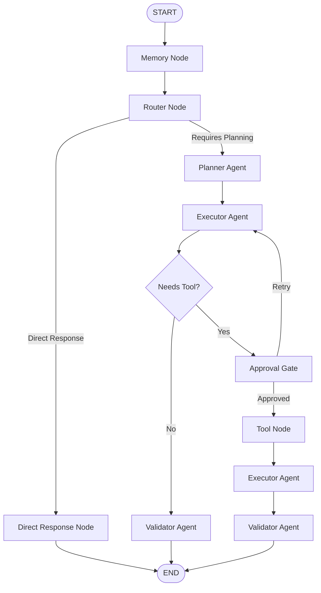

# 📥 Inbox OS - Advanced AI-Powered Mailbox Operating System

<div align="center">

[](https://fastapi.tiangolo.com)
[](https://github.com/langchain-ai/langgraph)
[](https://sqlmodel.tiangolo.com)
[](https://upstash.com)
[](https://www.postgresql.org)
[](https://developers.google.com/gmail/api)

**A production-grade, stateful AI Agent platform built using LangGraph, FastAPI, and robust Human-in-the-Loop workflows to transform standard email communication into intelligent, autonomous task orchestration.**

[Explore Docs](http://localhost:8000/docs) · [Report Bug](https://github.com/PunithKumar-A/inbox-os/issues) · [Request Feature](https://github.com/PunithKumar-A/inbox-os/issues)

</div>

---

## 📖 1. Project Overview

**Inbox OS** is not a simple chatbot wrapper; it is an intelligent, production-oriented AI operating system designed to securely ingest, analyze, compose, and organize email communication.

By modeling mailbox interactions as an **Agentic State Graph**, Inbox OS handles long-running, multi-step actions (such as summarizing invoice chains, cross-referencing attachments, and queuing security blacklists) with high reliability. The platform integrates industrial AI design patterns, combining stateful Short-Term & Long-Term Memory, multi-layered output validators, secure Google OAuth authentication, and interactive Human-in-the-Loop gates to guarantee that no email is sent or modified without explicit user authorization.

---

## 🎯 2. Why Inbox OS?

Most current "email assistants" are basic wrappers around Large Language Model (LLM) APIs. They ingest a prompt, call an API once, and return a text response. This approach fails in real-world email management because:

- **No Stateful Iteration**: They cannot plan complex, multi-stage workflows (e.g. search thread $\rightarrow$ fetch attachment $\rightarrow$ draft response $\rightarrow$ ask user $\rightarrow$ archive original).
- **Unreliable Tool Calling**: LLMs frequently hallucinate parameters or invoke tools out of order.
- **Safety Violations**: Directly executing actions (like sending emails or deleting folders) without a secure approval gate introduces high operational risk.
- **Lack of Contextual Memory**: They lose track of historical decisions, user preferences, and temporal changes across conversation chains.

**Inbox OS** addresses these limits by separating reasoning, planning, execution, and validation into a structured, deterministic State Graph. It scales dynamically, scales confidence scores automatically, and ensures **complete safety** via an integrated Human-Approval gateway.

---

## ⚡ 3. Key Features

- **Advanced Planner-Executor Architecture**: Decouples strategic planning from execution nodes, allowing the agent to evaluate multiple actions before calling external tools.
- **Robust Human-in-the-Loop Approvals**: A secure execution barrier that halts the graph on critical actions (e.g. `send_email`, `delete_thread`) and waits for user confirmation before proceeding.
- **Dual-Layer Memory Management**:
  - _Short-Term Memory_: Maintained within the LangGraph checkpoint layer for context preservation during an active session thread.
  - _Long-Term Memory_: Persisted in PostgreSQL to retain user configurations, styles, and instructions across distinct conversation histories.
- **Upstash Redis JWT Blacklisting**: Fast, serverless token blacklisting using the official `upstash-redis` client to revoke active user sessions instantly.
- **Real-time Streaming Responses**: Chunk-by-chunk token streaming for conversational UX and instantaneous tool logs feedback.
- **Validation Layer**: Rigorous Pydantic structure checks on LLM outputs to prevent tool call hallucinations and format anomalies.
- **Google OAuth & Gmail API**: Secure, token-encrypted Gmail API OAuth flow storing access keys safely in PostgreSQL.
- **Model Context Protocol (MCP) Tools**: Dynamically integrates with external MCP servers to execute complex system tasks beyond standard Gmail APIs.

---

## 🛠️ 4. Tech Stack

- **Backend Engine**: [FastAPI](https://fastapi.tiangolo.com/) (Asynchronous, High-Performance ASGI Framework)
- **Agent Framework**: [LangGraph](https://github.com/langchain-ai/langgraph) & [LangChain](https://github.com/langchain-ai/langchain) (Stateful multi-agent orchestrator)
- **Databases**: [PostgreSQL](https://www.postgresql.org/) (State storage & checks) & [Upstash Redis](https://upstash.com/) (Session blacklisting)
- **ORM & Validation**: [SQLModel](https://sqlmodel.tiangolo.com/) (Active-record style Pydantic + SQLAlchemy mapper)
- **Migrations**: [Alembic](https://alembic.sqlalchemy.org/) (Database migrations tool)
- **APIs & Protocols**: Google Gmail API, OAuth2, Model Context Protocol (MCP)

---

## 📐 5. System Design & Workflow



### Core Architecture Layers

1. **Memory Layer**: Combines Short-Term State (LangGraph Postgres Checkpointers) and Long-Term profiles (SQLModel) to load historical user behavior, settings, and instructions.
2. **Routing Layer**: Parses incoming requests to determine if they can be answered directly (e.g. general questions) or require multi-tool coordination.
3. **Planning Layer**: Instructs the Planner Agent to map out a sequence of actions, parameters, and targets needed to satisfy the query.
4. **Execution Layer**: Translates the strategic plan into API commands, executing Google Gmail or MCP operations.
5. **Human Approval Layer**: Blocks the state graph automatically when destructive actions are queued, waiting for a secure external callback before executing the payload.
6. **Tool Layer**: Executes authorized actions using secure access tokens refreshed on demand.
7. **Validation Layer**: Runs output checkers to verify parameter schemas and context relevance before saving the thread.

---

## 🧩 6. Workflow Nodes Explained

- **`Memory Node`**: Reads the active thread states and fetches the user’s long-term profile data from PostgreSQL. It loads custom styles, preferences, and system prompts to configure the agent context.
- **`Router Node`**: Analyzes the token parameters to classify user intent. If the query requires external data or action, it routes the state to the **Planner Agent**; otherwise, it bypasses planning to execute a **Direct Response**.
- **`Direct Response Node`**: Handles informational requests (e.g., system instructions or basic questions) that do not require external Gmail API or tool orchestrations, immediately returning the response to the user.
- **`Planner Agent`**: Drafts a structured plan outlining the steps, parameters, and dependencies required to perform the task.
- **`Executor Agent`**: Interprets the drafted plan and prepares specific tool arguments (e.g. drafting search strings or structuring compose payloads).
- **`Approval Agent / Gate`**: Evaluates the queued operations. If the operation is destructive (e.g. `send_email` or `trash_thread`), it halts graph execution, saves the checkpointer state, and awaits user authorization.
- **`Tool Node`**: Dispatches the action to Gmail, MCP, or database tools upon receiving user approval.
- **`Validator Agent`**: Evaluates the raw tool output or draft response against system instructions and formatting boundaries, repairing any discrepancies before resolving the thread.

---

## ⚙️ 7. Environment Variables

Create a `.env` file in the root of the project. A template is provided in [`.env.example`](file:///c:/Users/DVS/OneDrive/Desktop/gmail_backend/.env.example):

```ini
# ── DATABASE CONFIGURATION
DATABASE_URL=postgresql+asyncpg://<username>:<password>@<host>:<port>/<database>

# ── UPSTASH REDIS REST (JWT Blacklist)
UPSTASH_REDIS_REST_URL=https://<your-instance>.upstash.io
UPSTASH_REDIS_REST_TOKEN=<your-rest-token>

# ── JWT SECURITY
JWT_SECRET=<secure-random-hex>
JWT_ALGORITHM=HS256

# ── GOOGLE AUTH (Gmail API)
CLIENT_ID=<google-oauth-client-id>
CLIENT_SECRET=<google-oauth-client-secret>
GOOGLE_REDIRECT_URI=http://localhost:8000/gmail/g/callback

# ── AI MODELS (OpenRouter)
OPEN_AI_MODEL=openai/gpt-oss-120b:free
BASE_URL=https://openrouter.ai/api/v1
OPENROUTER_API_KEY=<your-api-key>

# ── NETWORK
ALLOWED_ORIGINS=http://localhost:8000,http://127.0.0.1:8000
MCP_URL=https://<your-mcp-server>.onrender.com/mcp
```

---

## 🚀 8. Getting Started

### Prerequisites

- Python 3.10+
- PostgreSQL Instance
- Upstash Redis Account

### Installation

1. **Clone the Repository**:
   ```bash
   git clone https://github.com/arunpunithkumar3-a11y/Inbox-Os.git
   cd Inbox-Os
   ```
2. **Create and Activate a Virtual Environment**:
   ```bash
   python -m venv .venv
   # Windows
   .venv\Scripts\activate
   # macOS/Linux
   source .venv/bin/activate
   ```
3. **Install Dependencies**:
   ```bash
   pip install -r requirements.txt
   ```
4. **Run Database Initialization**:
   ```bash
   python -c "import asyncio; from src.db.main import init_db; asyncio.run(init_db())"
   ```
5. **Start the API Server**:
   ```bash
   uvicorn src.db.main:app --port 8000 --reload
   ```
   *Once running, you can access the automatic interactive API documentation at **`http://localhost:8000/docs`**.*

---

## ☁️ 10. Deployment Guide

### Database & Redis Configuration

1. Provision a managed PostgreSQL instance (e.g. Render, AWS RDS, or Neon).
2. Provision an Upstash Redis database and retrieve the REST URL and Token credentials.

### Deploying to Render

1. Create a new **Web Service** on Render pointing to your GitHub repository.
2. Set the Environment to **Python 3**.
3. Configure your Build Command:
   ```bash
   pip install -r requirements.txt
   ```
4. Configure your Start Command:
   ```bash
   uvicorn src.db.main:app --host 0.0.0.0 --port $PORT
   ```
5. Add all keys from `.env.example` to Render's **Environment Variables** panel.

---

## 🗺️ 11. Future Roadmap

- [ ] **Local LLM Execution**: Integration of fully local open-source models using Ollama / vLLM.
- [ ] **Multi-Agent Teams**: Decouple task execution to sub-specialized agent clusters (e.g. Calendar Agent, Task List Agent).
- [ ] **Advanced Attachment Vectorization**: RAG-based search indexing inside PDF/CSV attachments.
- [ ] **Self-Correcting Tool Loops**: Automatically self-heal failed Gmail API calls using feedback execution nodes.

---

## 🤝 12. Contributing & License

Contributions are welcome! Please submit a PR or open an issue to discuss design enhancements.

Distributed under the MIT License. See `LICENSE` for more information.

---

## 👨‍💻 13. Built By

<div align="left">

**Punith Kumar A**  
_Founder & CEO, Broken Code_

I am a first-year BCA student highly passionate about Artificial Intelligence, Machine Learning, Agentic AI, and building production-grade software systems.

**Currently focused on:**

- 🧠 AI/ML Engineering & Generative AI
- 🤖 Complex Agentic Orchestration Systems (LangGraph/LangChain)
- ⚙️ High-Performance Backend Architectures
- 🚀 Building Disruptive Tech Startups

</div>
